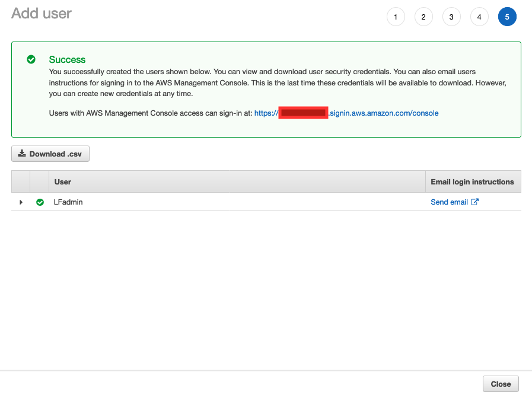

# Part 1 - Setup the Lake Formation users and the Glue Crawler role


For this lab, we will create a number of IAM users to be able to demonstrate different levels of access when they use Lake Formation and the related services like Athena.  In addition, we will use the Glue Crawler in this lab, so we will create a role that provides the permissions that the crawler will need.


## Create the Lake Formation Administrator user

First, we will create a user who will be our Lake Formation administrator.  For this lab, she will have the overall acount AdministratorAccess policy.  If you wanted to use a smaller set of permissions, you can refer to the [Lake Formation documentation](https://docs.aws.amazon.com/lake-formation/latest/dg/permissions-reference.html#persona-dl-admin) for specifcs.


* Navigate to the IAM Console


* Click on Users on the left hand column

* Then click the Add user button.

* Enter "LFadmin" for User name.  Check the "AWS Management Console access" box.  Enter a custom password that you will remember.  And uncheck the "User must create a new password" box.  Then click "Next: Permissions"


* Click the "Attach existing policies directly" button.  Then check the box for "AdministratorAccess".  Then click "Next: Tags"


* Click "Next: Review"

* Review the information and click "Create user"


Once your user is created, you should see a screen like this:




## Create two query users

Next, we will create two new users ("UserFlights" and "UserAll") to run queries.  In a later section of the lab, we will grant each user different Lake Formation permissions and demonstrate their different levels of access.


* Click the "Add user" button 


* Enter "UserFlights" for the User name.  Then click "Add another user"


* Enter "UserAll" for the 2nd User name.


* Check the "AWS Management Console access" box.  Enter a custom password that you will remember.  And uncheck the "User must create a new password" box.  Then click "Next: Permissions"


* Click the "Attach existing policies directly" button.  Then enter the search term "Athena".  Then check the box for "AmazonAthenaFullAccess".  


* Click the "Create policy" button.  A new browser tab will open.


* In the "Create policy" page, click on the JSON tab.  Paste the following into the text area (overwriting the previous contents):


```
{
    "Version": "2012-10-17",
    "Statement": [
        {
            "Effect": "Allow",
            "Action": [
                "lakeformation:GetDataAccess",
                "glue:GetTable",
                "glue:GetTables",
                "glue:SearchTables",
                "glue:GetDatabase",
                "glue:GetDatabases",
                "glue:GetPartitions"
            ],
            "Resource": "*"
        }
    ]
}

```

To read more about creating Lake Formation query users and what the above policy does, go [here](https://docs.aws.amazon.com/lake-formation/latest/dg/tut-create-lf-user.html)


* Click "Review policy" button at the bottom of the Create policy page.

* Name the policy "DatalakeUserBasic" and click "Create policy"


* You should see that the policy has been created.  


* Now go back to the previous browser tab where you were creating the 2 query users.


* Clear out the search field and type in "Datalake".  Then click on the Refresh button to the right of the "Create policy" button.  A picture of the Refresh button is shown below:


* Check the box in front of "DatalakeUserBasic".  Then click "Next: Tags"


* Click "Next: Review"

* Review the information and click "Create users"


## Create a role for use by Glue Crawler

* On the left hand column, click "Roles".  Then click "Create role" button.

* Click on Glue in the list of services that will use this role.  Then click "Next: Permissions"


* In the filter field, type s3 and then check the box for "AmazonS3ReadOnlyAccess".


* Now add Glue permissions, by typing glue and then checking the box for "AWSGlueServiceRole".


* Click "Next: Tags"

* Click "Next: Review"

* Name the role "GlueCrawlerRole" and click "Create role"


Once the role is created, you should a screen like this:


## Congratulations.

You have setup an IAM user to be the Lake Formation administrator.  And you have created two IAM users to be used as query users- we will grant them differing Lake Formation privileges in a later part of the lab. Finally, we created a role that the Glue Crawler can use.

Proceed onto [Part 2](Part2.md)
