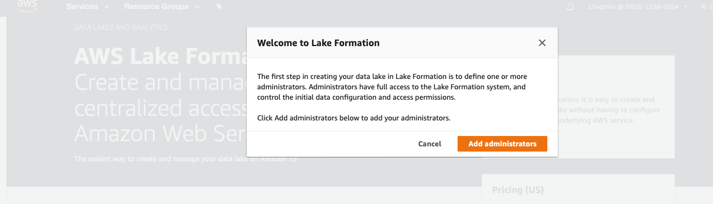
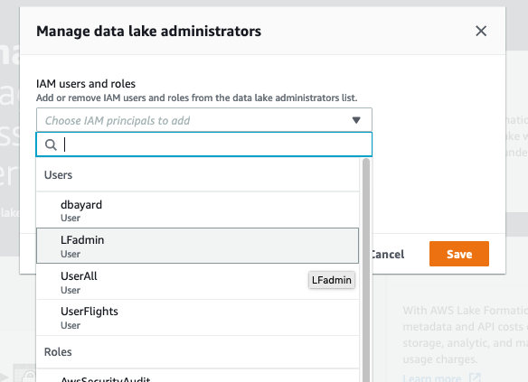
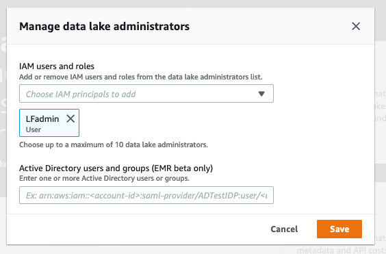
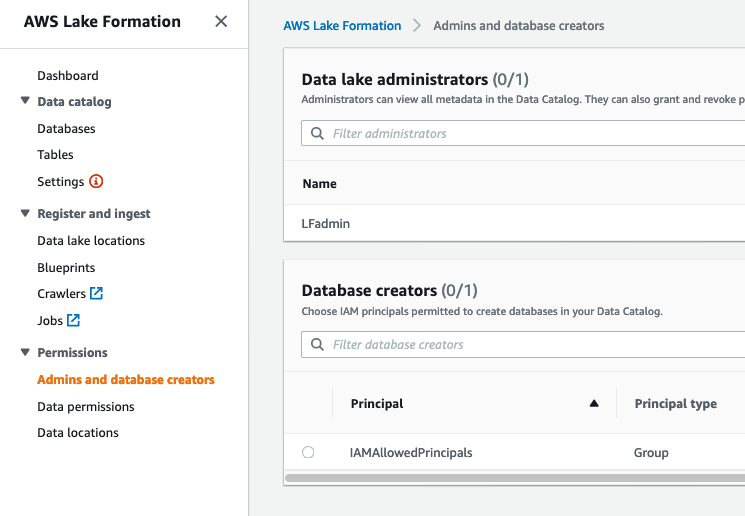
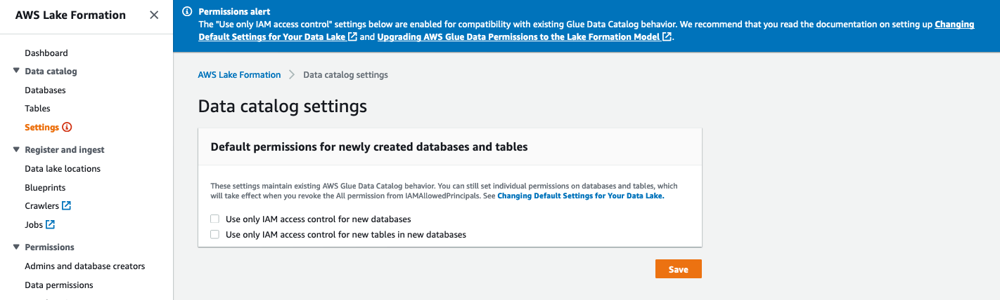
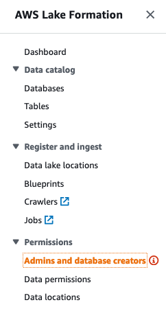
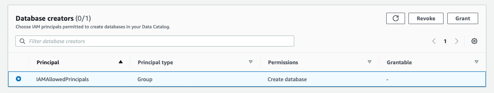
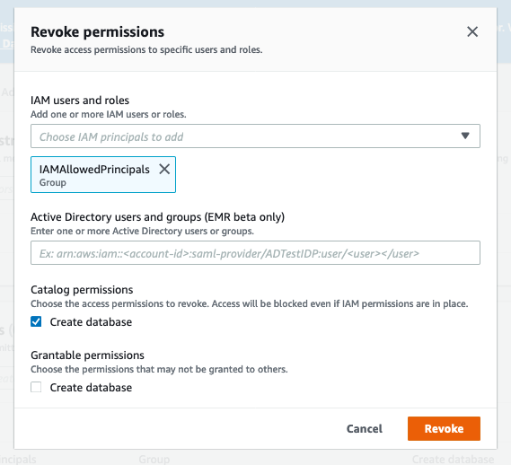

# Part 2 - Setup Lake Formation

In this part, we will setup Lake Formation.  Specifically, we will change the default security settings to use the Lake Formation permissions model.

To maintain backward compatibility with AWS Glue, by default AWS Lake Formation is initially setup so that access to Data Catalog resources and Amazon S3 locations is controlled solely by AWS Identity and Access Management (IAM) policies. 

We recommend that you change the default settings so that new Data Catalog resources are managed by Lake Formation permissions. This part of the Lab shows you how to do this. 

NOTE: This lab assumes you are running in a non-production account.  If you are in a production account, you should only change the permission model when you are ready as changing the model may cause some existing components to fail until you have granted explicit Lake Formation permissions to the required principals.

You can read more about switching to the Lake Formation permissions model [here](https://docs.aws.amazon.com/lake-formation/latest/dg/change-settings.html).

* While still logged in with a user/role that has IAM Administrator prilleges, Navigate to the Lake Formation Console.

* Click "Add administrators" button

Note: if you have previously setup Lake Formation in your account, you may see a different initial screen.

* In the drop-down list for "IAM users and roles", choose the "LFadmin" user.

* Click "Save"

## Configure the account to use Lake Formation Security permissions

* On the left-hand column, click on "Settings"

* Uncheck the 2 checkboxes.  Then click "Save"

* In the navigation pane, under Data catalog, choose Admins and database creators. 

* Under Database creators, select the IAMAllowedPrincipals group, and choose Revoke. 

* The Revoke permissions dialog box appears, showing that IAMAllowedPrincipals has the Create database permission.  Choose Revoke.

## Congratulations.

You have done the initial setup of Lake Formation and enabled the Lake Formation security privilege system.  

Proceed onto [Part 3](Part3.md)
