# Part 3 - Register S3 locations and Create databases

In this part, we will login as our Lake Formation Admin and register the S3 locations of two datasets.  The first dataset is Airline Flight data.  The second dataset is Amazon Product Reviews.  Both datasets are public datasets housed in S3 buckets.

Then, we will create two databases- one called Flights and one called Reviews.

## Login as LFadmin user

* Use the username drop-down at the top of the AWS console page and choose "Sign Out".


* Click the "Sign In to the Console" button


* Enter "LFadmin" for the IAM user name.  Enter the Password you used when creating the users for the Password.  Click "Sign In"


## Register S3 locations with Lake Formation

You can read more about registering a location [here](https://docs.aws.amazon.com/lake-formation/latest/dg/register-data-lake.html).


* Click on "Dashboard" on the left hand column

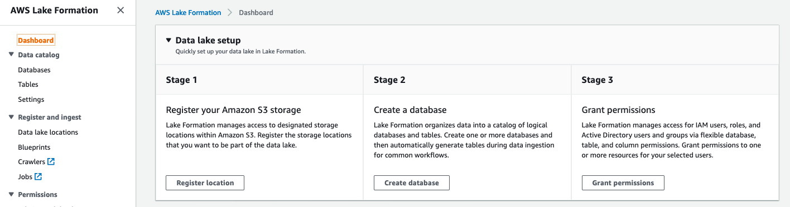

* Click on "Register location" button.  In the Amazon S3 Path, enter this value:

```
s3://us-east-1.elasticmapreduce.samples/flights/parquet/
```

* Then click "Register location" button.

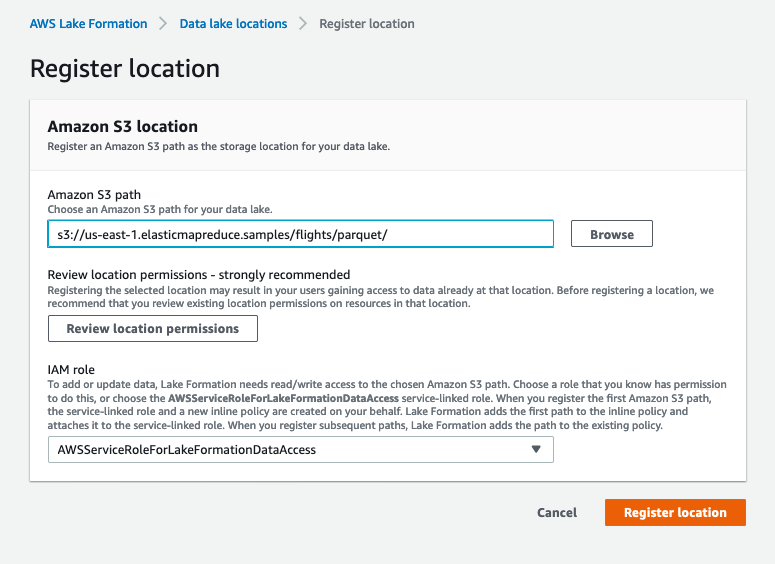

Once the location is registered, you should see a screen like this:

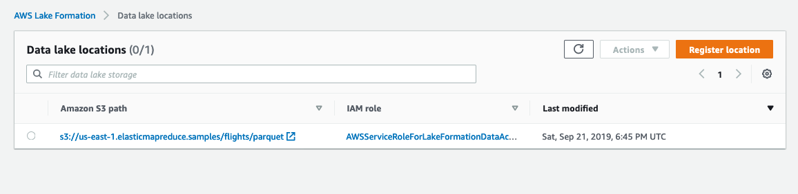

* On the Data lake locations page, click "Register location" to add a second location.  In the Amazon S3 Path, enter this value:

```
s3://amazon-reviews-pds/parquet/
```

* Then click "Register location" button.

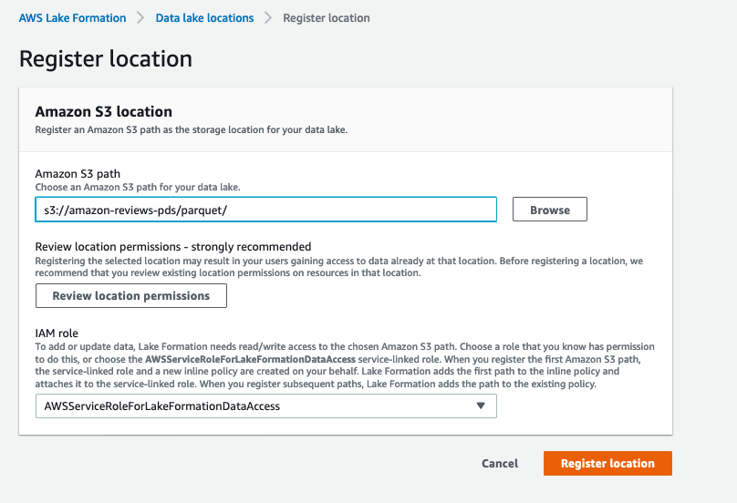

Once this location is registered, you should see a screen like this:

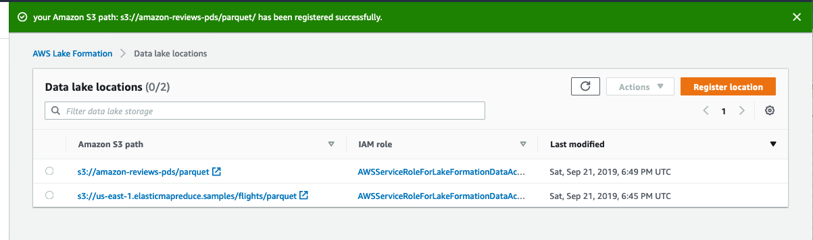


## Create databases in Lake Formation

You can read more about creating databases [here](https://docs.aws.amazon.com/lake-formation/latest/dg/creating-database.html).


* On the left hand column, click "Dashboard"


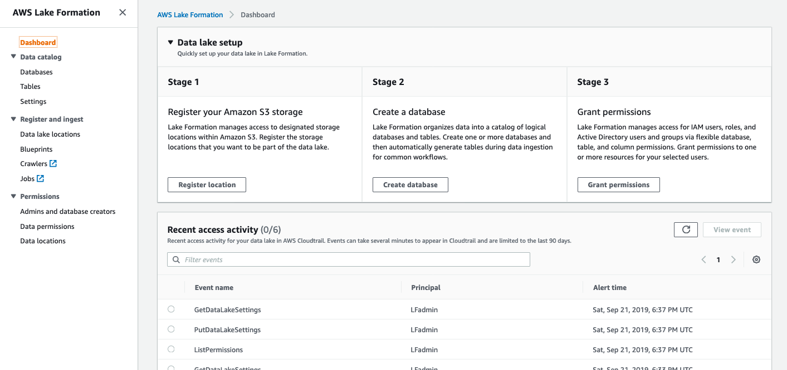


* Click the Create database button

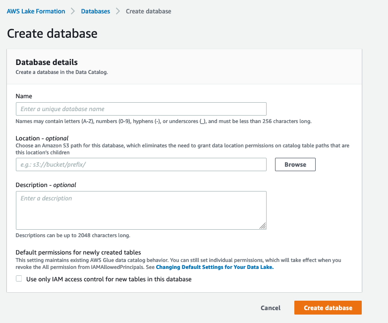

* Enter "flights" for the Name

* For the Location, enter this value:

```
s3://us-east-1.elasticmapreduce.samples/flights/parquet/
```

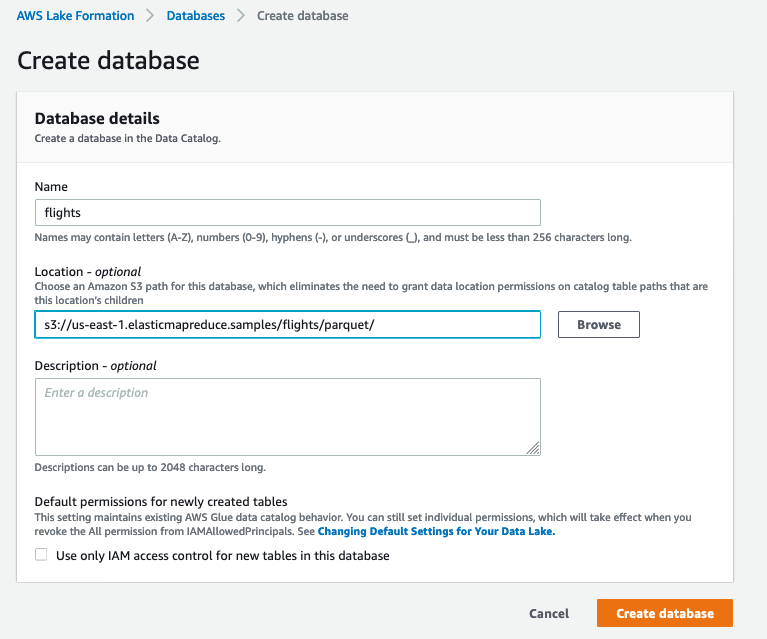

* Click the Create database button

Once the database is created, you should see a page like this:

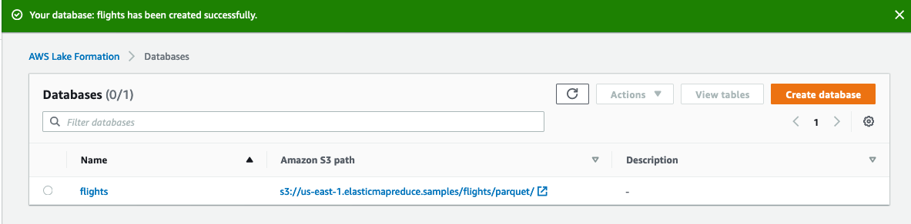

* On the Databases page, click "Create database button" to create a 2nd database

* Enter "reviews" for the Name

* For the Location, enter this value:

```
s3://amazon-reviews-pds/parquet/
```


## Grant privileges on the databases to Glue Crawler

Finally, let's authorize the Glue Crawler to create new table definitions in our databases.

* On the left hand column, click "Dashboard"


* Click the Grant permissions button

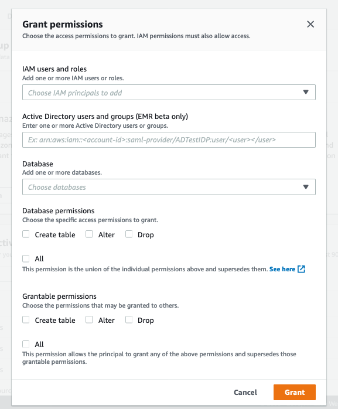

* Use the "IAM users and roles" drop-down, and scroll-down and choose the "GlueCrawlerRole".

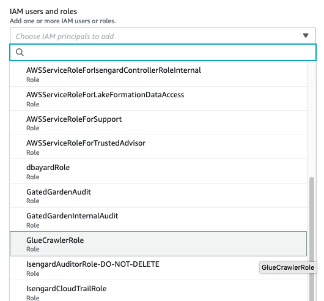

* Use the "Database" drop-down and select the flights database.  Then do the same for the review database.

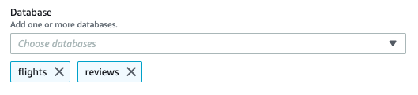

* Check the box in front of "All" in the Database permissions section.  Then click "Grant"

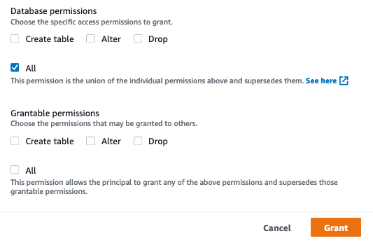

Once you the permissions are created, you should see a screen like this:


## Congratulations.

And you have registered the two S3 locations that we will use later in this lab.  You have created two databases in Lake Formation and granted the Glue Crawler permissions to add tables to them.  Next we will use the Glue Crawler to add some tables.

Proceed onto [Part 4](Part4.md)
