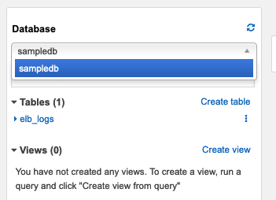

# Part 5 - Access the tables (without permissions)

## Try accessing the tables as the UserFlights

UserFlights has not been granted any access yet in Lake Formation, so we don't expect UserFlights to be able to query these tables.

* Use the username drop-down at the top of the AWS console page and choose "Sign Out".

* Click the "Sign In to the Console" button

* Enter "UserFlights" for the IAM user name.  Enter the Password you used when creating the users for the Password.  Click "Sign In"

* Navigate to the Athena Console.

* Click Get Started

* Close the tutorial window

* In the Database drop-down, notice that UserFlights does not see the Flights or Reviews databases

## Congratulations.

You have seen that Lake Formation does not let a user without permissions to a table see or access it.  Next, we will use our Lake Formation administrator to grant permissions to our query users.

Proceed onto [Part 6](Part6.md)
