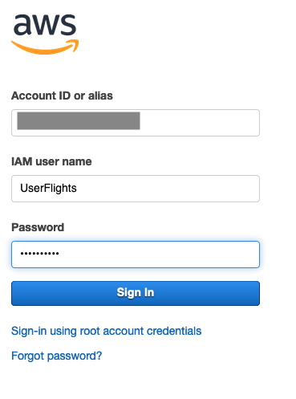

# Part 5 - Access the tables (without permissions)

In this section, we will connect as one of query users ("UserFlights") and try to query the Flights dataset.  We don't expect this to work because we have not granted any permissions to the Flights table yet, but we will try anyways.

## Try accessing the tables as the UserFlights

* Use the username drop-down at the top of the AWS console page and choose "Sign Out".

* Click the "Sign In to the Console" button

* Enter "UserFlights" for the IAM user name.  Enter the Password you used when creating the users for the Password.  Click "Sign In"

* Navigate to the Athena Console.

* Click Get Started if this is your first time using Athena

NOTE: If you click on the "Get Started" button, but get a "Insufficient Lake Formation permission(s): Required Create Database on Catalog" message, then click on this [https://console.aws.amazon.com/athena/home?force&region=us-east-1#query](https://console.aws.amazon.com/athena/home?force&region=us-east-1#query).  This error message occurs when the user first tries to access Athena and Athena is trying to create a "sampledb" database as part of a built-in tutorial.  

* Close the Athena tutorial window if one pops-up.

* In the Database drop-down, notice that UserFlights does not see the Flights or Reviews databases

Note: You may or may not see the "sampledb" database depending on if you have previously used Athena in this account prior to this lab.

## Congratulations.

You have seen that Lake Formation does not let a user without permissions to a table see or access it.  Next, we will use our Lake Formation administrator to grant permissions to our query users.

Proceed onto [Part 6](Part6.md)
