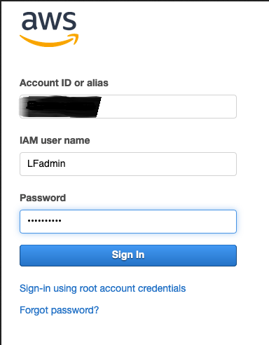
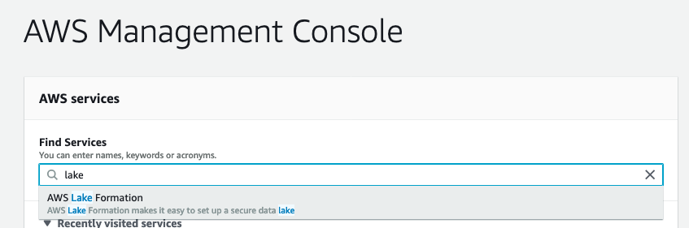
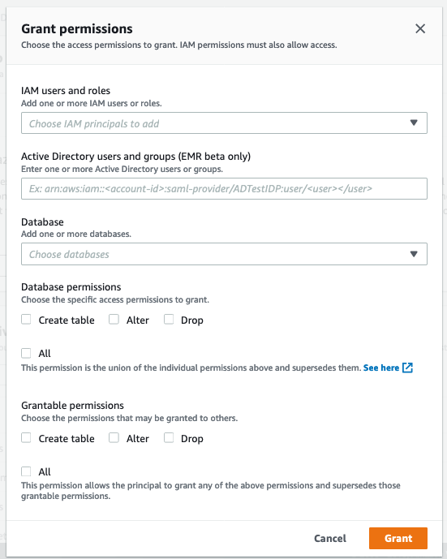
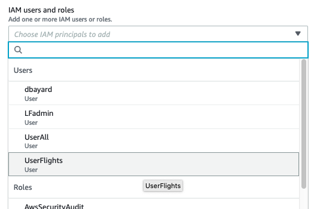
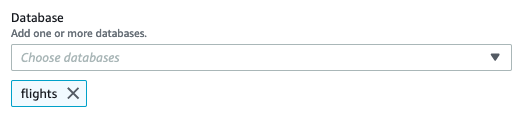
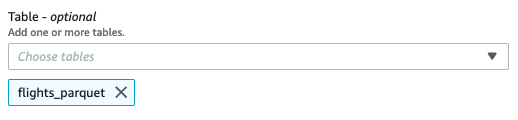
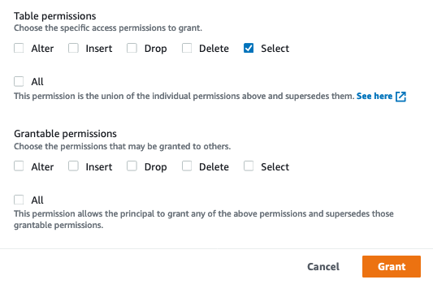
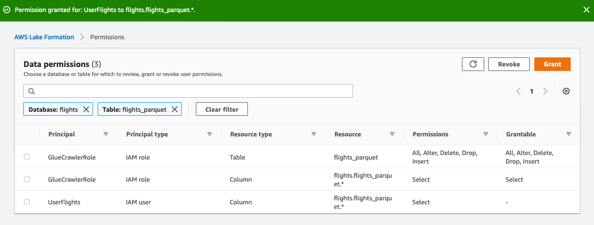
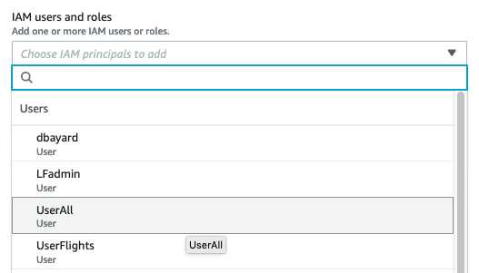
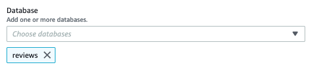

# Part 6 - Grant permissions to our users

## Use the Lake Formation administrator to grant permissions

* Use the username drop-down at the top of the AWS console page and choose "Sign Out".

* Click the "Sign In to the Console" button

* Enter "LFadmin" for the IAM user name.  Enter the Password you used when creating the users for the Password.  Click "Sign In"

* Navigate to the Lake Formation Console.

## Grant permissions for the Flights table to UserFlights

* On the left-hand column of the Lake Formation Console, click "Dashboard".  On the Dashboard page, click the "Grant permissions" button.

* With the "IAM users and roles" drop-down, choose "UserFlights".

* With the Database drop-down, choose "Flights"

* With the Table drop-down, choose "flights_parquet"

* For table permissions, choose "Select".  Then click the Grant button

## Grant permissions for UserAll to the Reviews table

* Click the "Grant" button on the Data permissions page

* With the "IAM users and roles" drop-down, choose "UserAll".

* With the Database drop-down, choose "Reviews"

* With the Table drop-down, choose "reviews_parquet"

* For table permissions, choose "Select".  Then click the Grant button

### Now do the same for the Flights table for UserAll

* Click the "Grant" button on the Data permissions page

* With the "IAM users and roles" drop-down, choose "UserAll".

* With the Database drop-down, choose "Flights"

* With the Table drop-down, choose "flights_parquet"

* For table permissions, choose "Select".  Then click the Grant button

## Congratulations.

You have used granted Lake Formation security permissions to UserFlights and UserAll.  UserFlights only has permissions on the Flights table.  UserAll has permissions on both the Flights and Reviews tables.  Next, let's verify their access.

Proceed onto [Part 7](Part7.md)

