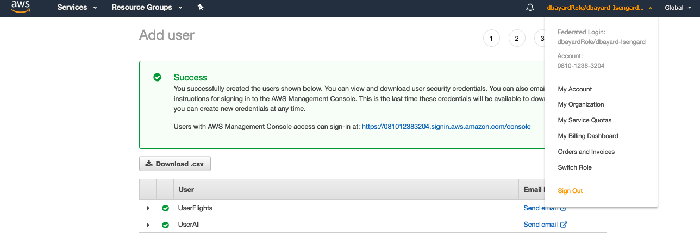
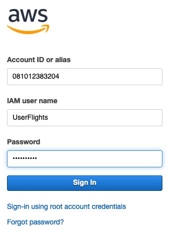
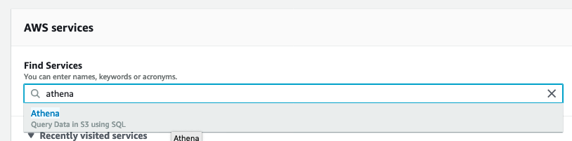
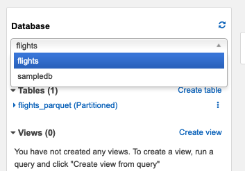
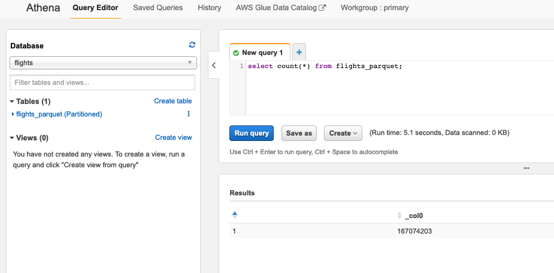
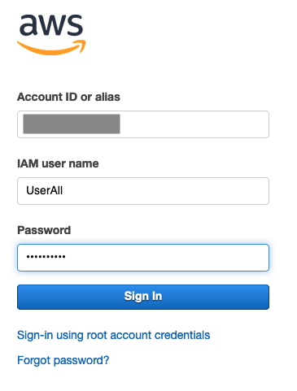
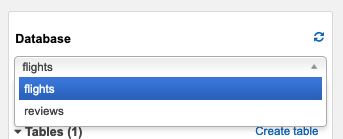
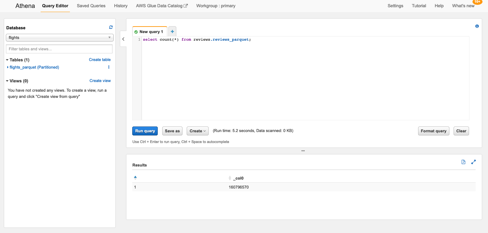

# Part 7 - Access the tables (with permissions)


## Test with the UserFlights user

UserFlights has now been granted access to just the flights table (but not the reviews table).

* Use the username drop-down at the top of the AWS console page and choose "Sign Out".



* Click the "Sign In to the Console" button


* Enter "UserFlights" for the IAM user name.  Enter the Password you used when creating the users for the Password.  Click "Sign In"



* Navigate to the Athena Console.



* Click Get Started

* Notice that you now see the Flights database and the flights_parquet table in the navigator on the left.



* In the query editor, enter this query

```
select count(*) from flights_parquet;

```

* Click "Run query"



Notice that the permissions work as expected.  UserFlights can access the flights_parquet table but does not see the reviews_parquet table.


## Test with the UserAll user

UserAll has now been granted access to both tables.

* Use the username drop-down at the top of the AWS console page and choose "Sign Out".


* Click the "Sign In to the Console" button


* Enter "UserAll" for the IAM user name.  Enter the Password you used when creating the users for the Password.  Click "Sign In"



* Navigate to the Athena Console.


* Click Get Started if needed

* Notice that you now see both the Flights and Reviews databases in the navigator on the left.



* In the query editor, enter this query

```
select count(*) from reviews.reviews_parquet;

```

* Click "Run query"



Notice that the permissions work as expected.  UserAll can access both the flights_parquet and reviews_parquet tables.

## Congratulations.

You have validated that UserFlights only has permissions on the Flights table and that UserAll has permissions on both the Flights and Reviews tables.  


