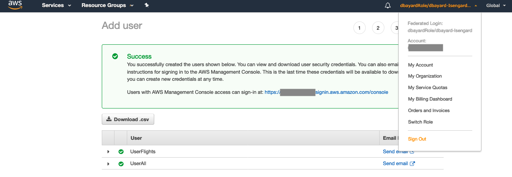

# Lake Formation Security Demonstration

## Setup the initial users

### Create the Lake Formation Administrator user

* Navigate to the IAM Console


* Click on Users on the left hand column

* Then click the Add user button.

* Enter "LFadmin" for User name.  Check the "AWS Management Console access" box.  Enter a custom password that you will remember.  And uncheck the "User must create a new password" box.  Then click "Next: Permissions"


* Click the "Attach existing policies directly" button.  Then check the box for "AdministratorAccess".  Then click "Next: Tags"


* Click "Next: Review"

* Review the information and click "Create user"


* Copy the sign-in url (https://######.signin.aws.amazon.com/console) and save it in a notepad or text editor for later.  Click "Close"


### Create two query users

* Click the "Add user" button 


This is based on the instructions [here](https://docs.aws.amazon.com/lake-formation/latest/dg/tut-create-lf-user.html)

* Enter "UserFlights" for the User name.  Then click "Add another user"


* Enter "UserAll" for the 2nd User name.


* Check the "AWS Management Console access" box.  Enter a custom password that you will remember.  And uncheck the "User must create a new password" box.  Then click "Next: Permissions"


* Click the "Attach existing policies directly" button.  Then enter the search term "Athena".  Then check the box for "AmazonAthenaFullAccess".  


* Click the "Create policy" button.  A new browser tab will open.


* In the "Create policy" page, click on the JSON tab.  Paste the following into the text area (overwriting the previous contents):


```
{
    "Version": "2012-10-17",
    "Statement": [
        {
            "Effect": "Allow",
            "Action": [
                "lakeformation:GetDataAccess",
                "glue:GetTable",
                "glue:GetTables",
                "glue:SearchTables",
                "glue:GetDatabase",
                "glue:GetDatabases",
                "glue:GetPartitions"
            ],
            "Resource": "*"
        }
    ]
}

```


* Click "Review policy" button at the bottom of the Create policy page.

* Name the policy "DatalakeUserBasic" and click "Create policy"


* You should see that the policy has been created.  


* Now go back to the previous browser tab where you were creating the 2 query users.


* Clear out the search field and type in "Datalake".  Then click on the refresh button 


* Check the box in front of "DatalakeUserBasic".  Then click "Next: Tags"


* Click "Next: Review"

* Review the information and click "Create users"


### Create a role for use by Glue Crawler

* On the left hand column, click "Roles".  Then click "Create role" button.

* Click on Glue in the list of services that will use this role.  Then click "Next: Permissions"


* In the filter field, type s3 and then check the box for "AmazonS3ReadOnlyAccess".


* Now add Glue permissions, by typing glue and then checking the box for "AWSGlueServiceRole".


* Click "Next: Tags"

* Click "Next: Review"

* Name the role "GlueCrawlerRole" and click "Create role"


## Login as the LFadmin user and setup Lake Formation

### Login as LFadmin user

* Use the username drop-down at the top of the AWS console page and choose "Sign Out".



* Click the "Sign In to the Console" button


* Enter "LFadmin" for the IAM user name.  Enter the Password you used when creating the users for the Password.  Click "Sign In"


* Navigate to the Lake Formation Console.


* Click "Add administrators" button

Note: if you have previously setup Lake Formation in your account, you may see a different initial screen.


* In the drop-down list for "IAM users and roles", choose the "LFadmin" user.


* Click "Save"


### Configure the account to use Lake Formation Security permissions

* On the left-hand column, click on "Settings"


* Uncheck the 2 checkboxes.  Then click "Save"


### Register S3 locations with Lake Formation

* Click on "Dashboard" on the left hand column


* Click on "Register location" button.  In the Amazon S3 Path, enter this value:

```
s3://us-east-1.elasticmapreduce.samples/flights/parquet/
```

* Then click "Register location" button.


* On the Data lake locations page, click "Register location" to add a second location.  In the Amazon S3 Path, enter this value:

```
s3://amazon-reviews-pds/parquet/
```

* Then click "Register location" button.


### Create databases

* On the left hand column, click "Dashboard"


* Click the Create database button


* Enter "flights" for the Name

* For the Location, enter this value:

```
s3://us-east-1.elasticmapreduce.samples/flights/parquet/
```


* Click the Create database button


* On the Databases page, click "Create database button" to create a 2nd database

* Enter "reviews" for the Name

* For the Location, enter this value:

```
s3://amazon-reviews-pds/parquet/
```


### Grant privileges on the databases to Glue Crawler

* On the left hand column, click "Dashboard"


* Click the Grant permissions button


* Use the "IAM users and roles" drop-down, and scroll-down and choose the "GlueCrawlerRole".


* Use the "Database" drop-down and select the flights database.  Then do the same for the review database.


* Check the box in front of "All" in the Database permissions section.  Then click "Grant"


## Create tables by crawling our S3 locations

* On the left-hand column of the Lake Formation console, click on "Crawlers"


* If this is your first time using Glue in this account, click the "Get started" button.

* Click the "Add tables using a crawler" button

* Enter "flights_crawl" for the Crawler name and click "Next"


* Leave the source type as "Data stores" and click "Next" again

* Enter this value in the "Include path" field:

```
s3://us-east-1.elasticmapreduce.samples/flights/parquet/
```


* Click Next

* Leave the radio button as "No" and click "Next" 

* Change the radio button to "Choose an existing IAM role".  Select the "GlueCrawlerRole".  Then click "Next"


* Leave the frequency to "Run on demand" and click "Next"

* Pick flights for the database using the drop-down.  Enter "flights_" as the prefix for the tables.  Click Next


* Click Finish

* Then click the "Run it now link" (see below)


### Add another crawler for the Reviews database

* Click the "Add crawler" button.

* Enter "reviews_crawl" for the Crawler name and click "Next"


* Leave the source type as "Data stores" and click "Next" again

* Enter this value in the "Include path" field:

```
s3://amazon-reviews-pds/parquet/
```


* Click Next

* Leave the radio button as "No" and click "Next" 

* Change the radio button to "Choose an existing IAM role".  Select the "GlueCrawlerRole".  Then click "Next"


* Leave the frequency to "Run on demand" and click "Next"

* Pick reviews for the database using the drop-down.  Enter "reviews_" as the prefix for the tables.  Click Next


* Click Finish

* Then click the "Run it now link" (see below)


* Wait for both crawlers to finish running.


Notice that each crawler has added 1 table.

* Click on Tables on the left hand column of the Glue console.  


These are the 2 tables that the crawlers created.

## Access the tables

### Try accessing the tables as the UserFlights

UserFlights has not been granted any access yet in Lake Formation, so we don't expect UserFlights to be able to query these tables.

* Use the username drop-down at the top of the AWS console page and choose "Sign Out".


* Click the "Sign In to the Console" button


* Enter "UserFlights" for the IAM user name.  Enter the Password you used when creating the users for the Password.  Click "Sign In"


* Navigate to the Athena Console.


* Click Get Started

* Close the tutorial window

* In the Database drop-down, notice that UserFlights does not see the Flights or Reviews databases


### Grant permissions to our users


* Use the username drop-down at the top of the AWS console page and choose "Sign Out".


* Click the "Sign In to the Console" button


* Enter "LFadmin" for the IAM user name.  Enter the Password you used when creating the users for the Password.  Click "Sign In"


* Navigate to the Lake Formation Console.


* On the left-hand column of the Lake Formation Console, click "Dashboard".  On the Dashboard page, click the "Grant permissions" button.


* With the "IAM users and roles" drop-down, choose "UserFlights".


* With the Database drop-down, choose "Flights"


* With the Table drop-down, choose "flights_parquet"


* For table permissions, choose "Select".  Then click the Grant button


### Grant permissions for UserAll

* Click the "Grant" button on the Data permissions page


* With the "IAM users and roles" drop-down, choose "UserAll".


* With the Database drop-down, choose "Reviews"


* With the Table drop-down, choose "reviews_parquet"


* For table permissions, choose "Select".  Then click the Grant button


#### Now do the same for the Flights database & table for UserAll

* Click the "Grant" button on the Data permissions page


* With the "IAM users and roles" drop-down, choose "UserAll".


* With the Database drop-down, choose "Flights"


* With the Table drop-down, choose "flights_parquet"


* For table permissions, choose "Select".  Then click the Grant button


### Try accessing the tables as the UserFlights

UserFlights has now been granted access to just the flights table (but not the reviews table).

* Use the username drop-down at the top of the AWS console page and choose "Sign Out".


* Click the "Sign In to the Console" button


* Enter "UserFlights" for the IAM user name.  Enter the Password you used when creating the users for the Password.  Click "Sign In"


* Navigate to the Athena Console.


* Click Get Started

* Notice that you now see the Flights database and the flights_parquet table in the navigator on the left.


* In the query editor, enter this query

```
select count(*) from flights_parquet;

```

* Click "Run query"


### Try accessing the tables as the UserAll

UserAll has now been granted access to both tables.

* Use the username drop-down at the top of the AWS console page and choose "Sign Out".


* Click the "Sign In to the Console" button


* Enter "UserAll" for the IAM user name.  Enter the Password you used when creating the users for the Password.  Click "Sign In"


* Navigate to the Athena Console.


* Click Get Started if needed

* Notice that you now see both the Flights and Reviews databases in the navigator on the left.


* In the query editor, enter this query

```
select count(*) from reviews.reviews_parquet;

```

* Click "Run query"


